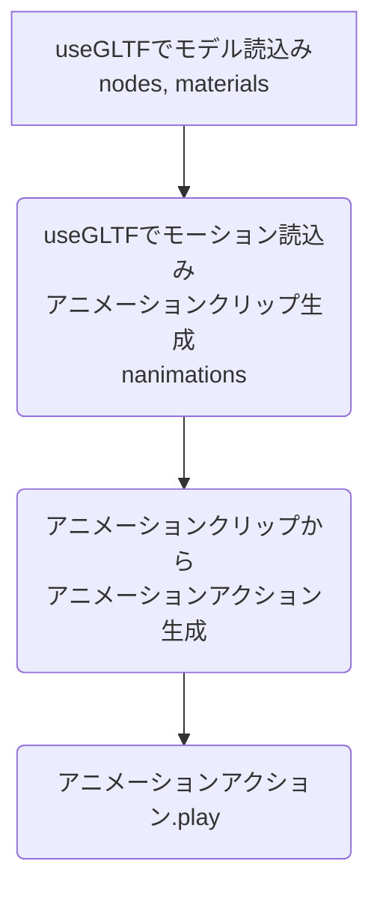

# react-r3f-advanced004
React+TypeScript+R3Fのtutorial応用編4(glTFで3Dアニメーション(モデルとモーション別々ファイル読込み))


# まとめ
## 1.アニメーションの使い方


## 2.アニメーションアクションで設定する文字列の調べ方
```ts:App.tsx
    actions['Armature|mixamo.com|Layer0']!.play()
```
↑ここで設定する文字列('Armature|mixamo.com|Layer0')は、Blenderで開いて確認する。


